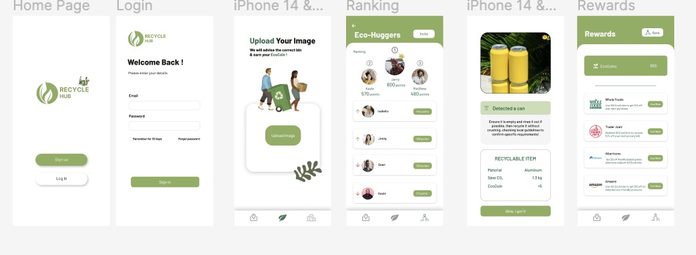

# garbage-classification
Hack Davis 2024

# UI



# DOCUMENT

```python
# change to your key
api_key = "your_key"

```


## Website Quickstart

Flask (black-end)

There are the first few steps to help you to run up both projects (Flask and React).

## Flask

Flask is a Web framework, and it is used as a RESTFul API in our project, to provide back-end server. It based on Python, and we use `pip` to manage all python packages.

[More Info](https://flask.palletsprojects.com/en/3.0.x/)

To check if `pip` and `python` work in your terminal or not.
```shell
# you could use python (pip) or python3 (pip3), in this tutorials, we go with python3.
python --version
pip --version

# or

python3 --version
pip3 --version
```

if not, please install [Python](https://www.python.org/downloads/) first.

### Run Flask Project

Install package:

```shell
python3 -m venv .venv
. .venv/bin/activate
pip3 install Flask

# install restful api
pip3 install Flask-RESTful

# install Flask CORS
pip3 install Flask-CORS

# install OpenAI Api
pip install --upgrade openai

# install Requests
pip install requests
```


Run Flask:
```shell
# go to the path where app.py is on.
cd ./src/server
python3 -m flask run
```

In development environment, we use port 5000, go to [http://127.0.0.1:5000](http://127.0.0.1:5000)

